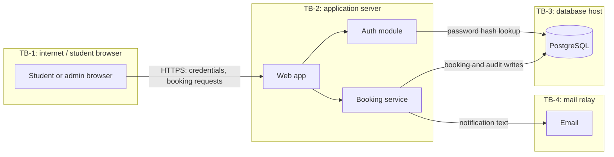

# Architecture: Lab Booking

## System overview
A server-rendered FastAPI application backed by PostgreSQL, deployed on one
university VM behind HTTPS. One module owns authentication so it can be
replaced by single sign-on later.

## Components
| Component | Responsibility | Talks to | Serves |
|---|---|---|---|
| Web app (FastAPI) | Pages, API, sessions, authorization | Database, mail relay | FR-001 to FR-006 |
| Auth module | Password check, lockout, session issue | Database | FR-001, FR-002, NFR-002 |
| Booking service | Create, conflict-check, decide | Database | FR-003 to FR-005 |
| Database (PostgreSQL) | Users, instruments, bookings, audit log | Web app | FR-004, FR-005 |

## Tech stack
| Layer | Choice | Why this | Alternatives considered |
|---|---|---|---|
| Language and framework | Python, FastAPI | Department standard; team knows it | Django (heavier than needed) |
| Database | PostgreSQL | Database-level overlap prevention (ADR-001) | SQLite (cannot enforce it safely under concurrency) |
| Pages | Server-rendered templates | Fewer moving parts; smaller attack surface | Single-page app |

## Data-flow diagram

Trust boundaries: TB-1 browser to server (all input untrusted), TB-2 app to
database, TB-3 database host, TB-4 app to mail relay.

## Key decisions
- [ADR-001: PostgreSQL with an exclusion constraint for overlaps](adr/ADR-001-postgresql-exclusion-constraint.md)
- [ADR-002: Local password login in v1, SSO later](adr/ADR-002-local-auth-first.md)

## Known risks and technical debt going in
Local passwords make us responsible for password storage until SSO exists.
No automated reminders to admins in v1.
