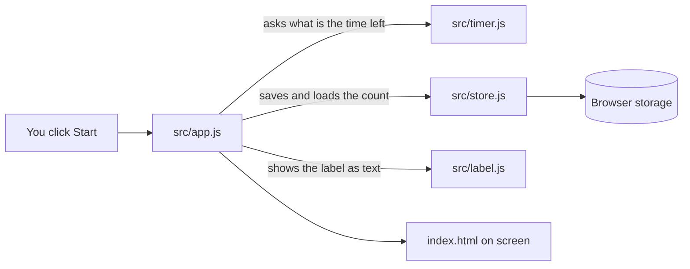

# Builder's Guide: Study Timer

*Level: beginner. Written from the code as it exists. Last verified against the
project on 2026-10-01. Commit: not a git repo.*

## At a glance
Study Timer is a one-page web timer for studying. You press Start, it counts
down 25 minutes of focus, then 5 minutes of break, and beeps at the end of each.
It remembers how many focus blocks you finished today, and it can show what you
are studying next to the clock.

It is built with plain HTML, CSS, and JavaScript, with no add-on packages, because
your course teaches plain JavaScript and the page is tiny (see D-001 in
`docs/DECISIONS.md`).

**Where it stands:** 8 requirements. 3 are Done and proven by a test or a scan.
5 are Partial: the code is written and its logic is tested, but nobody has yet
clicked through it in a real browser. 0 are Not built. Details are under
"Requirements coverage".

## How to run it
- Install: nothing to install. There are no dependencies.
- Run: `python3 -m http.server 8000`, then open http://localhost:8000 in your browser.
  (Double-clicking `index.html` will not work: browsers refuse to load JavaScript
  modules from a file on your disk. See D-003.)
- Test: `npm test`. A pass looks like `# pass 13` and `# fail 0`.

I ran the tests (13 passed) and checked that the server returns every file. I did
not open the page in a browser.

## The big picture
Think of a kitchen. `index.html` is the counter customers see. `src/app.js` is the
waiter who takes clicks and brings back results. `src/timer.js` is the chef who
decides what happens next. `src/store.js` is the notebook that remembers today's
count. `src/label.js` is the person who writes the study label on the board
safely.

**Why it is split this way:** the timer logic (`timer.js`) has no screen code in it,
so tests can check it without opening a browser. Only `app.js` touches the page.

**Differs from the plan:** nothing was dropped or added. One behaviour the plan
never mentioned is listed under "Limits and known gaps" (the count at midnight).

## Project tour
| Path | What it does | Edit it when |
|---|---|---|
| `index.html` | The page: clock, buttons, label box, and a small style block | You change how it looks or add a button |
| `src/app.js` | Connects clicks and the clock to the logic; the only file that touches the screen | You add a feature the user can see or click |
| `src/timer.js` | The countdown rules: start, pause, switch from focus to break | You change how time or phases work |
| `src/label.js` | Cleans the study label and shows it safely as text | You change what the label may contain |
| `src/store.js` | Saves and loads today's count and the label in the browser | You change what is remembered |
| `tests/` | Automatic checks for the timer, label, and storage | You change any rule above (update the matching test first) |
| `package.json` | Tells `npm test` how to run the tests; lists no dependencies | You add a tool or change the test command |
| `docs/SPEC.md` | What the app must do and how each part is checked | A requirement changes |
| `docs/SECURITY.md` | The 10-line security checklist and its evidence | You finish or change a safety measure |
| `docs/DECISIONS.md` | The log of choices and why | You make a decision worth remembering |
| `AGENTS.md` | Instructions that remind the AI how to work on this project | You change how the AI should work |

## Walkthrough
**Flow 1: you press Start**
1. Your click runs the function attached at `src/app.js:42`.
2. It calls `start` (`src/timer.js:28`), which records the moment the block will end: now plus the time left.
3. `render` (`src/app.js:27`) runs straight away and draws the time with `formatTime` (`src/timer.js:8`).
4. After that, `setInterval` (`src/app.js:57`) calls `render` every quarter of a second so the display stays fresh.

**Flow 2: a focus block ends**
1. On each `render`, the line at `src/app.js:29` asks `tick` (`src/timer.js:45`) whether time is up.
2. If it is, `tick` returns a new state: phase is now break, `completed` is one higher, and a new end time is set.
3. Back in `render`, the `if` at `src/app.js:31` saves the count (`src/store.js:22`) and plays the beep (`src/app.js:13`).

**Flow 3: you type what you are studying**
1. Each keystroke runs the handler at `src/app.js:52`.
2. `renderLabel` (`src/label.js:10`) puts the cleaned text on the page as plain text, so a label like `<b>hi</b>` shows literally and never runs as code.
3. The label is saved so it is still there after a reload (`src/app.js:54`).

## Requirements coverage
| ID | Where it lives | Status | Evidence |
|---|---|---|---|
| FR-001 | `src/timer.js:28-36`, `src/app.js:42-43` | Partial | test: tests/timer.test.js::counts_down_from_25_minutes proves the countdown logic. Not done: pressing Start and Pause in a real browser |
| FR-002 | `src/timer.js:45` | Done | test: tests/timer.test.js::switches_phase_at_zero |
| FR-003 | `src/app.js:13-25` | Partial | Code is written (Mute at `src/app.js:44`). Not done: hearing the beep in a browser with ?debug=5 |
| FR-004 | `src/store.js:13-28`, `src/app.js:10` | Partial | test: tests/store.test.js::count_survives_reload proves saving and loading. Not done: a real page reload |
| FR-005 | `src/label.js:10` | Done | test: tests/label.test.js::label_is_shown_as_text_not_html, plus scan: grep found no use of innerHTML in the code |
| NFR-001 | `src/timer.js:38-42` | Partial | test: tests/timer.test.js::remaining_time_follows_the_clock simulates a 10-minute sleep. Not done: a real 25-minute run in a background tab |
| NFR-002 | `index.html` | Partial | Uses only standard browser features. Not done: running the checks in Chrome and Firefox |
| NFR-003 | `index.html`, `src/app.js` | Done | scan: sum of bytes of index.html and src/*.js is 6,934 (about 6.8 KB), limit 50 KB |

## Security status
Checked and done: no secrets in the code (scan: grep found none), the label and
the `?debug=` value are validated or shown as text (tests), there are no packages
to check, and no error text reaches the user. Items 3, 4, 5, and 9 do not apply
(no database, accounts, server, or uploads).

**Still open:** checklist item 8, HTTPS. The app is not published yet, so this is
not verified. Tick it after deploying to GitHub Pages and confirming the padlock.
Nothing is an accepted risk. See `docs/SECURITY.md`.

## Performance
| Target | Goal | Measured | How measured |
|---|---|---|---|
| Timer accuracy (NFR-001) | within 1 s over 25 min | 0 s error in a simulated 600 s gap | test: tests/timer.test.js::remaining_time_follows_the_clock |
| Page weight (NFR-003) | 50 KB or less | 6.8 KB (6,934 bytes) | scan: byte total of index.html and src/*.js as served by python3 -m http.server |
| Test run time | no target | about 0.26 s | scan: duration reported by npm test |
| Load time on a phone | no target set | Not measured | n/a |

## Concepts
- **Module** (`src/app.js:2`): a file that shares some of its functions with other files using `export` and `import`. It keeps each file small and focused.
- **Pure function** (`src/timer.js:8`): a function that only looks at what you give it and gives back an answer, with no side effects. That makes it easy to test.
- **Clock-based timing** (`src/timer.js:38`): instead of counting ticks (which drift when a tab sleeps), it always asks "how long until the end time?". D-002 records the decision.
- **Browser storage** (`src/store.js:13`): a small notebook the browser keeps for your page, so numbers survive a reload.
- **textContent vs innerHTML** (`src/label.js:10`): `textContent` shows text as text. `innerHTML` would run any HTML or script someone typed in, which is a classic attack, so it is never used.
- **Test** (`tests/timer.test.js`): a small program that checks another part works. Running them after every change is how you know you did not break something.

## Limits and known gaps
- **Midnight:** if you leave the page open past midnight, the count keeps counting up under the new day instead of starting again at 0 (`src/app.js:32` saves the running count under today's date).
- **Two tabs** do not talk to each other; each keeps its own running timer.
- **Clearing browser data** erases the count and the label.
- **Beep** depends on the browser allowing audio; if it is blocked, the screen change is the only signal (`src/app.js:22`).
- **No lint or type checker** is set up yet; the project is plain JavaScript.
- **Not published**, so HTTPS has not been checked.

## Changing it safely
**Change the block lengths.** Edit `DEFAULT_LENGTHS` at `src/timer.js:6`. Then fix the tests that expect 1500 and 300 seconds in `tests/timer.test.js`, run `npm test`, update the wording in `docs/SPEC.md`, and add a line to `docs/DECISIONS.md`.

**Add a long break after four sessions.** Change `tick` (`src/timer.js:45`) to pick the next phase from `completed`. Write the test first in `tests/timer.test.js`, then change the code. Update FR-002 in `docs/SPEC.md` and log it.

**Change what is remembered.** Edit `src/store.js`, update `tests/store.test.js`, and check `docs/SECURITY.md`, because anything you store from the user is untrusted text.

If you change X, also check Y: change `timer.js` -> rerun all tests and the manual `?debug=5` check; change `label.js` -> rerun `tests/label.test.js` and the security checklist item 2; add any package -> do the dependency check (checklist item 6).

## Check yourself
Q1. Which file and function decide when focus switches to break?
Q2. You leave the tab asleep for 10 minutes while a block is running. What does the clock show when you come back, and why?
Q3. You want a 15-minute break after every fourth focus block. Which files do you change, and what do you do before and after?
Q4. A friend says the finished-block count vanished after a reload. Where do you look first?
Q5. Which requirements are only Partial, and what single thing would make them Done?
Q6. Why does the label use `textContent` and not `innerHTML`?

### Answers
A1. `tick` in `src/timer.js:45`. It compares the current time with the end time and, when time is up, returns a new state with the next phase.
A2. It shows the correct remaining time (for example 15:00 if you started a 25-minute block 10 minutes ago), because `remainingSeconds` (`src/timer.js:38`) subtracts the clock time from the end time instead of counting ticks. The test `remaining_time_follows_the_clock` checks exactly this.
A3. `src/timer.js` (change `tick` at line 45) and `tests/timer.test.js`. Write or adjust the test first, run `npm test` after the change, then update FR-002 in `docs/SPEC.md` and add an entry to `docs/DECISIONS.md`.
A4. `src/store.js:13` (`loadCount`) and `src/store.js:22` (`saveCount`), and how `src/app.js:10` loads the count and `src/app.js:32` saves it. Remember the count is saved only when a block ends, and check whether the browser blocked storage.
A5. FR-001, FR-003, FR-004, NFR-001, and NFR-002. They are written and their logic is tested, but a person has not yet run them in a real browser. Doing the manual checks in `docs/SPEC.md` (with `?debug=5`) in Chrome and Firefox would move them to Done.
A6. The label is typed by the user, so it is untrusted. `textContent` (`src/label.js:10`) shows it as plain text; `innerHTML` would run any HTML or script inside it. The test `label_is_shown_as_text_not_html` checks this.

## What I could not verify
No browser was available, so I did not click Start, Pause, or Mute, hear the beep,
reload the page, test Chrome and Firefox, or run a real background-tab timer. I did
not deploy the app, so HTTPS is unchecked. I did run `npm test` (13 passed), a
syntax check on every file, a scan for secrets and for dangerous patterns, and I
confirmed the local server returns every file.
