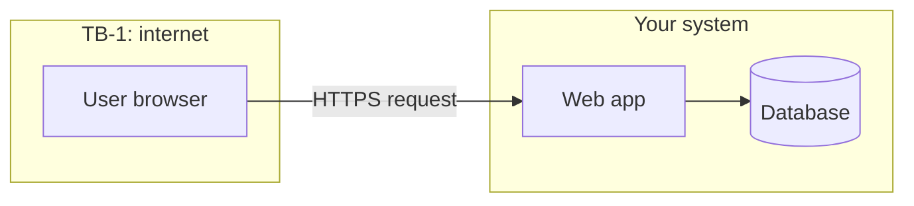

# ARCHITECTURE.md template (Standard and Full tracks)

Load this when writing `docs/ARCHITECTURE.md`. Write it **before** SECURITY.md:
the data-flow section is the input to the threat model.

## Rules

- Justify every stack choice against at least one real alternative. A choice
  with no reasoning is a decision someone will reverse for no good reason.
- Reference requirement IDs (`FR-001`) where a component exists to satisfy
  them.
- Mark **trust boundaries** on the data flow: every place data crosses from
  something you control to something you do not (user input hitting the
  server, the server calling a third-party API, a service calling another).
- Anything the brief does not decide becomes an open-question marker.

## Template

```markdown
# Architecture: <Project Name>

## System overview
Short description plus a simple diagram (ASCII or mermaid).

## Components
| Component | Responsibility | Talks to | Serves |
|---|---|---|---|
| <frontend> | <...> | <backend> | FR-001, FR-002 |

## Tech stack
| Layer | Choice | Why this | Alternatives considered |
|---|---|---|---|

## Data flow
End-to-end path of the one or two most important use cases. Mark each trust
boundary as `[TB-1]`, `[TB-2]`, ... so SECURITY.md can refer to them.

## Key decisions
Standard: a short ADR-style list (decision, alternatives, why, cost).
Full: an index to `docs/adr/` (see below) instead of repeating them here.

## Known risks and technical debt going in
What is knowingly accepted for speed, and what fixing it later would take.
```

## Full track additions

### Data-flow diagram (required)
Use a mermaid diagram with trust boundaries drawn as subgraphs:



Label each arrow with what data moves and over what protocol.

### Architecture Decision Records (ADRs)
One file per significant decision: `docs/adr/ADR-001-<slug>.md`, numbered in
order, never edited after acceptance (a new ADR supersedes an old one). An
ADR is a short note recording a big choice and the reasoning behind it, so
nobody has to reverse-engineer it later. Minimum two ADRs on a Full project
(for example, the data store and the authentication approach).

```markdown
# ADR-001: <Decision title>

- Status: Proposed | Accepted | Superseded by ADR-00N
- Date: <date>
- Requirements affected: FR-001, NFR-002

## Context
What forced the decision.

## Decision
What was chosen.

## Alternatives considered
Each option and why it lost.

## Consequences
What this costs and what it makes easier. Every real decision has a cost.
```

ADRs record decisions made **before** building. `docs/DECISIONS.md` is the
lightweight log for decisions and changes made **during** the build; see
`decisions.md`.
